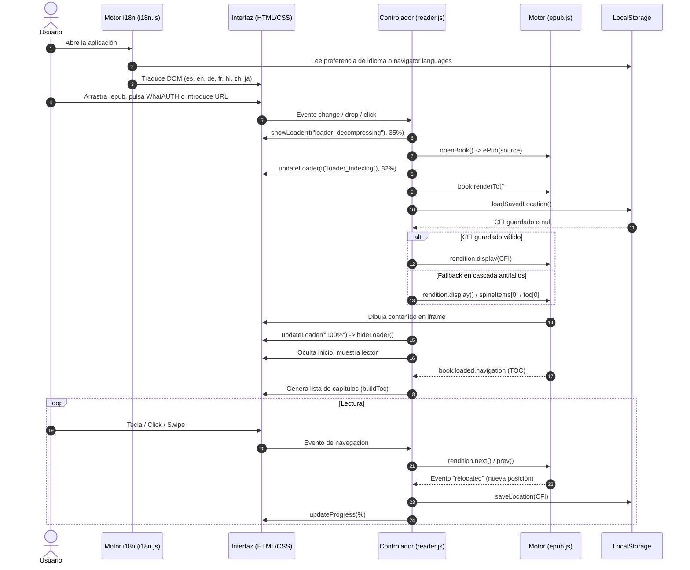

# 📖 Guía de Arquitectura y Funciones del Proyecto: Lector EPUB

Este documento detalla la estructura del proyecto, la responsabilidad de cada archivo y la descripción exhaustiva de todas las funciones, eventos, arquitectura de internacionalización (i18n) y flujos de datos que componen el lector de libros electrónicos.

---

## 🗺️ Visión General de la Arquitectura

El proyecto es una **Single Page Application (SPA) 100% estática** que corre íntegramente en el navegador, sin necesidad de backend o servidor Node.js.
Aprovecha las bibliotecas **epub.js** (renderizado y parser de formato EPUB) y **JSZip** (descompresión interna del archivo contenedor `.epub`), complementado con un motor propio y reactivo de **internacionalización (i18n)**.

```
epub-reader/
├── index.html          # Estructura del DOM (pantallas, barras, modales, selectores y paneles)
├── style.css           # Sistema de diseño, temas (Claro, Sepia, Oscuro), glassmorphism y animaciones
├── i18n.js             # Motor i18n nativo con soporte para 7 idiomas y autodetección
├── reader.js           # Lógica de la aplicación, control de estado, listeners y eventos
├── README.md           # Documentación de despliegue y uso para GitHub Pages
├── guide.md            # Esta guía técnica detallada de funciones y arquitectura
├── fenix_icons.md      # Documentación del conjunto completo de favicons y app icons
├── fenix_icons/        # Paquete de favicons y touch icons para web, Android, iOS y Windows
├── img/                # Recursos gráficos e imágenes de fondo (epub.jpeg, libro.jpeg, etc.)
└── libros/             # Libros precargados (ej. demo.epub / WhatAUTH)
```

---

## 1. `index.html` (Estructura y Vistas)

Define las dos pantallas principales de la aplicación, el pie de página de autoría, los selectores de idioma y la inclusión de dependencias.

### Dependencias y scripts:
* **`jszip.min.js` (v3.10.1):** Descomprime los archivos `.epub` en memoria (un `.epub` es un contenedor `.zip` con XHTML, CSS e imágenes).
* **`epub.min.js` (v0.3.93):** Motor que interpreta el estándar IDPF/EPUB, gestiona las páginas (rendition), las secciones (spines), la navegación y el cálculo de porcentajes/CFIs.
* **`i18n.js`:** Motor de traducciones que se inicializa antes del renderizado de la UI para aplicar el idioma correcto sin parpadeos.
* **Script de compatibilidad bfcache y Permissions Policy (`<head>`):** Intercepta `addEventListener("unload")` y lo redirige a `pagehide`, eliminando alertas de consola y acelerando la navegación con el Back/Forward Cache.

### Secciones del DOM:

1. **Pantalla de Inicio (`#start-screen`):**
   * `.start-lang-bar`: Barra superior de la tarjeta con selector de idioma (`#start-lang-select.i18n-select`) e icono de globo 🌐.
   * `#drop-zone`: Zona interactiva para soltar archivos arrastrados con imagen de fondo estética (`img/libro.jpeg` / `img/epub.jpeg`) y superposición traslúcida adaptativa por tema.
   * `#file-input`: Input nativo oculto (`<input type="file" accept=".epub">`) accionado por la etiqueta interactiva "Elegir archivo".
   * `#url-input` y `#load-url-btn`: Campo de texto y botón para cargar libros mediante un enlace web público o ruta relativa (`./libros/libro.epub`).
   * `.featured-book-wrapper` y `#load-whatauth-btn`: Botón destacado para abrir con 1 clic el libro gratuito de **WhatAUTH** (cargando `./libros/demo.epub`).
   * `.start-footer`: Pie de pantalla con diseño de cristal (*glassmorphism*) en formato píldora que incluye:
     * Crédito de autor: **[fenix.ninja](https://fenix.ninja)**.
     * Enlace con icono SVG oficial al repositorio abierto en **[GitHub](https://github.com/fenixninja/epub-reader)**.

2. **Pantalla del Lector (`#reader-screen`):**
   * **Barra de herramientas superior (`#toolbar`):**
     * `#btn-back`: Botón para cerrar el libro actual y regresar a la pantalla de inicio.
     * `.book-info`: Contenedores `#book-title` y `#book-author` para mostrar los metadatos del libro.
     * `#btn-toc`: Abre el panel lateral con la tabla de contenidos (índice).
     * `#btn-settings`: Abre el panel lateral de ajustes.
   * **Área de lectura principal (`#viewer-container`):**
     * `#viewer`: Contenedor `div` en el cual `epub.js` monta el iframe del libro.
     * `#prev` y `#next`: Botones flotantes laterales para pasar página.
   * **Barra de progreso inferior (`#progress-bar`):**
     * `#progress-fill`: Barra visual de relleno porcentual.
     * `#progress-text`: Indicador numérico (ej. `42%`).
   * **Panel lateral de índice (`#toc-panel`):**
     * `#close-toc`: Botón de cierre.
     * `#toc-list`: Contenedor donde se generan dinámicamente los enlaces a cada capítulo.
   * **Panel lateral de ajustes (`#settings-panel`):**
     * Selector de idioma integrado (`#settings-lang-select.i18n-select`).
     * Selector de temas (`data-theme`: `light`, `sepia`, `dark`).
     * Selector de modo de lectura (`data-reading-mode`: `fast` con `Fast Sans` [por defecto] o `normal` con `Sans clásico`).
     * Selector de BeeLine Reader (interruptor toggle on/off y selector de 3 degradados modernos: *Atardecer*, *Océano*, *Aurora*).
     * Control de tamaño de fuente (`#font-decrease`, `#font-size-value`, `#font-increase`).
     * Selector de modo de visualización (`data-flow`: `paginated` o `scrolled`).
   * **Capa de bloqueo (`#overlay`):** Fondo oscurecido para cerrar paneles al hacer clic fuera de ellos.
   * **Overlay de Carga y Descompresión (`#loader-overlay`):**
     * Pantalla flotante con efecto cristal (`backdrop-filter: blur(10px)`) que informa visualmente del progreso porcentual al descomprimir y procesar libros.
     * `#loader-percent`: Indicador numérico tabular en tiempo real (0% al 100%).
     * `#loader-progress-fill`: Barra horizontal animada de progreso.
     * `#loader-status`: Texto explicativo de la fase actual (*Descomprimiendo libro*, *Analizando contenedor*, *Indexando capítulos*, etc.).
     * `#loader-error-container`: Panel de error con mensaje amigable y botón `#loader-error-btn` ("Volver al inicio").

---

## 2. `i18n.js` (Motor de Internacionalización)

Sistema nativo ultraligero que proporciona soporte multilingüe completo sin dependencias externas.

### Idiomas Soportados

| Código | Idioma | Bandera |
| :---: | :--- | :---: |
| `es` | Español (Predeterminado) | 🇪🇸 |
| `en` | English | 🇺🇸 |
| `de` | Deutsch | 🇩🇪 |
| `fr` | Français | 🇫🇷 |
| `hi` | हिन्दी (Hindi) | 🇮🇳 |
| `zh` | 中文 (Chino) | 🇨🇳 |
| `ja` | 日本語 (Japonés) | 🇯🇵 |

### Clase `I18nManager`
Expuesta globalmente como `window.i18n`.

* **`detectLanguage()`**:
  1. Comprueba `localStorage.getItem("reader_lang")`.
  2. Si no existe, inspecciona `navigator.languages` o `navigator.language`.
  3. Hace coincidir el código ISO de 2 letras con los idiomas disponibles.
  4. Si no hay coincidencia, retorna `"es"` por defecto.
* **`t(key, fallback)`**:
  Devuelve la cadena traducida para la clave solicitada en el idioma activo; si no existe, recurre al diccionario en español o al fallback indicado.
* **`setLanguage(lang)`**:
  Cambia el idioma activo, lo persiste en `localStorage`, actualiza el atributo `lang` en `<html>`, re-traduce el DOM y sincroniza todos los selectores `.i18n-select`.
* **`applyTranslations()`**:
  Recorre todos los elementos del DOM con atributos:
  * `[data-i18n]`: Actualiza el contenido HTML interno.
  * `[data-i18n-placeholder]`: Actualiza el atributo `placeholder` de inputs.
  * `[data-i18n-title]`: Actualiza el atributo `title` (tooltips accesibles).

---

## 3. `reader.js` (Lógica y Controladores)

Todo el código está encapsulado en una función autoejecutable (IIFE `(() => { ... })()`) para evitar colisiones en el ámbito global.

### Variables de Estado

| Variable | Tipo | Descripción |
|---|---|---|
| `book` | `ePub.Book` | Instancia principal del libro gestionada por `epub.js`. |
| `rendition` | `ePub.Rendition` | Objeto que gestiona el renderizado visual, estilos inyectados y eventos del iframe del libro. |
| `currentTheme` | `string` | Tema activo (`"light"`, `"sepia"`, `"dark"`). Persistido en `localStorage` (`"epub-theme"`). |
| `fontSize` | `number` | Porcentaje de tamaño de fuente (70% - 180%). Persistido en `localStorage` (`"epub-font-size"`). |
| `currentFlow` | `string` | Modo de lectura (`"paginated"` por páginas o `"scrolled"` por desplazamiento continuo). |
| `currentReadingMode` | `string` | Modo de tipografía (`"fast"` con Fast Sans por defecto, `"normal"` con Sans). Persistido en `localStorage` (`"epub-reading-mode"`). |
| `beelineEnabled` | `boolean` | Indica si la lectura guiada BeeLine Reader está activada. Persistido en `localStorage` (`"epub-beeline-enabled"`). |
| `beelineGradient` | `string` | Estilo de degradado activo (`"sunset"`, `"ocean"`, `"aurora"`). Persistido en `localStorage` (`"epub-beeline-gradient"`). |
| `bookKey` | `string` | Identificador alfanumérico derivado del nombre del archivo para almacenar y recuperar la posición de lectura. |

---

### Funciones Principales

#### `injectFontStyles(contents)`
* **Objetivo:** Inyecta en el `<head>` del iframe del EPUB la regla `@font-face` con URL absoluta hacia `fonts/Fast_Sans.ttf` y el selector con `!important` para sobrescribir las fuentes internas que pudiera tener el libro.
* **Operaciones:**
  1. Resuelve la URL absoluta del archivo `.ttf` mediante `new URL('fonts/Fast_Sans.ttf', window.location.href).href`.
  2. Crea y adjunta el elemento `<style id="epub-font-face">`.
  3. Crea y actualiza `<style id="epub-font-override">` con la familia tipográfica activa.

#### `applyReadingMode(mode)`
* **Objetivo:** Alterna entre el modo de lectura rápida (`Fast Sans`) y el modo tradicional (`Sans`), actualizando botones activos y persistiendo la selección en `localStorage`.

#### `applyBeeLine()`
* **Objetivo:** Implementa la lectura guiada por degradados cromáticos BeeLine Reader en el DOM del iframe del libro.
* **Operaciones:**
  1. Limpia cualquier `span.beeline-word` previo.
  2. Recorre los nodos de texto de los párrafos (`p, li, h1..h6`).
  3. Mide la posición vertical `offsetTop` de cada palabra para agruparlas por líneas físicas reales según el tamaño de la ventana.
  4. Interpola los colores de inicio y fin de línea según la paleta activa (*Atardecer*, *Océano* o *Aurora*) y el tema (Claro, Sepia u Oscuro).

#### `showLoader(statusText, initialPercent)` / `updateLoader(percent, statusText)` / `hideLoader()`
* **Objetivo:** Gestionan la visualización del progreso en tiempo real de la descompresión y renderizado del EPUB.

#### `openBook(source, name)`
* **Objetivo:** Descomprime y procesa el libro.
* **Flujo en Cascada Antifallos:**
  1. **Intento 1:** Recupera la última posición guardada en `localStorage` (`loadSavedLocation()`).
  2. **Intento 2:** Si falla o es nula, llama a `rendition.display()`.
  3. **Intento 3:** Si falla la visualización por defecto, localiza el primer elemento del spine (`book.spine.spineItems[0]`).
  4. **Intento 4:** Si falla el spine, salta al primer capítulo del TOC (`nav.toc[0].href`).
  5. Fuerza un redibujado de seguridad (`rendition.resize()`) para garantizar que la portada o la primera página siempre sean visibles de inmediato.

#### `loadBookFromUrl(url, name)`
* **Objetivo:** Descarga libros desde enlaces web o rutas relativas utilizando la API `ReadableStream` para reportar el porcentaje de descarga antes de pasar el ArrayBuffer a `openBook`.

---

### Controladores de Eventos del Usuario

* **Selección de archivo local (`fileInput`):** Lee el archivo mediante `FileReader` con evento `onprogress` reportando del 0% al 30% en el loader, y envía el buffer a `openBook`.
* **Arrastrar y soltar (`dropZone`):** Valida extensión `.epub`, reporta progreso de lectura y ejecuta `openBook`.
* **Carga por URL (`loadUrlBtn` y tecla `Enter` en `urlInput`):** Invoca `loadBookFromUrl` con seguimiento de descarga.
* **Botón libro WhatAUTH (`#load-whatauth-btn`):** Carga directamente el libro demo configurado en `data-book-url` mediante `loadBookFromUrl`.
* **Botones de navegación (`#prev`, `#next`):** Invocan `rendition.prev()` y `rendition.next()`.
* **Botón volver (`#btn-back` y `#loader-error-btn`):** Destruye la instancia del libro, restablece el título traducido y regresa a `#start-screen`.
* **Gestos táctiles / Swipe:** Si el desplazamiento horizontal supera los 60px, avanza o retrocede de página.
* **Parámetros en la URL (Carga automática):** Soporta `?book=`, `?epub=` o `?url=`.

---

## 4. `style.css` (Diseño y Estilos)

### Sistema de Tokens CSS (Variables)
1. **Tema Claro (`:root`):** Fondo cálido tipo papel (`#f8f6f1`), texto carbón (`#1a1a1a`), acento azul (`#2563eb`).
2. **Tema Oscuro (`[data-theme="dark"]`):** Fondo OLED/negro suave (`#121212`), texto claro (`#e8e8e8`), acento celeste (`#60a5fa`).
3. **Tema Sepia (`[data-theme="sepia"]`):** Fondo apergaminado (`#f4ecd8`), texto marrón editorial (`#5b4636`), acento madera (`#8b5e3c`).

### Componentes Clave:
* **Selectores de Idioma (`.start-lang-bar`, `.lang-select-wrapper`, `.i18n-select`):** Píldoras compactas con micro-animaciones en focus/hover para alternar idioma instantáneamente.
* **Zona de Drop con Fondo Gráfico (`.drop-zone`):** Capa con imagen de fondo (`url('img/libro.jpeg')` / `epub.jpeg`), gradiente de opacidad para garantizar legibilidad del texto en cualquier tema, y resplandor al arrastrar archivos (`.dragover`).
* **Botón Libro Recomendado (`.featured-book-wrapper`, `.featured-book-btn`):** Tarjeta interactiva con insignia de color, tipografía destacada y flecha animada en hover.
* **Pie de Página de Inicio (`.start-footer`):** Barra flotante en formato píldora con desenfoque de fondo (*glassmorphism*), créditos a **fenix.ninja** y enlace con icono SVG a **GitHub**.
* **Modal Loader (`.loader-overlay`, `.loader-card`):** Capa flotante con efecto *glassmorphism* (`backdrop-filter: blur(10px)`), anillo giratorio (`.loader-ring`), icono pulsante y porcentaje numérico tabular de alto contraste (`.loader-percent`).

---

## 5. `fenix_icons.md` y Recursos Gráficos

Documenta la especificación completa de los 24+ archivos de iconos contenidos en [`fenix_icons/`](fenix_icons/):
* **Apple Touch Icons:** Todos los tamaños oficiales de 57x57 hasta 180x180 px.
* **Android & Chrome PWA:** Favicon de 192x192 px y manifest web.
* **Favicons estándar:** `.ico`, 16x16, 32x32, 96x96 y 256x256 px.
* **Windows Tiles:** Mosaicos interactivos con `browserconfig.xml`.

---

## 🔄 Flujo de Datos y Ciclo de Vida de una Lectura


