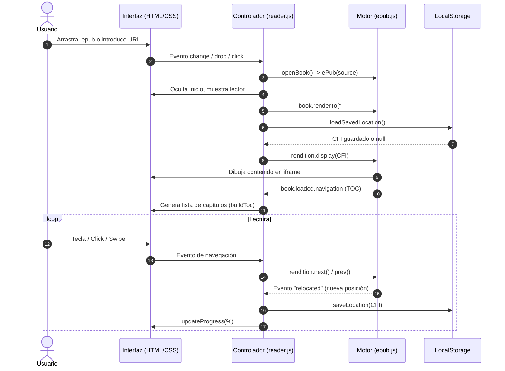

# 📖 Guía de Arquitectura y Funciones del Proyecto: Lector EPUB

Este documento detalla la estructura del proyecto, la responsabilidad de cada archivo y la descripción exhaustiva de todas las funciones, eventos y flujos de datos que componen el lector de libros electrónicos.

---

## 🗺️ Visión General de la Arquitectura

El proyecto es una **Single Page Application (SPA) 100% estática** que corre íntegramente en el navegador, sin necesidad de backend o servidor Node.js. 
Aprovecha las bibliotecas **epub.js** (renderizado y parser de formato EPUB) y **JSZip** (descompresión interna del archivo contenedor `.epub`).

```
epub-reader/
├── index.html       # Estructura del DOM (pantallas, barras, modales y paneles)
├── style.css        # Sistema de diseño, temas (Claro, Sepia, Oscuro) y animaciones
├── reader.js        # Lógica de la aplicación, control de estado y eventos
├── README.md        # Documentación de despliegue y uso para GitHub Pages
└── guide.md         # Esta guía técnica detallada de funciones y arquitectura
```

---

## 1. `index.html` (Estructura y Vistas)

Define las dos pantallas principales de la aplicación y la inclusión de dependencias externas.

### Dependencias externas (CDN):
* **`jszip.min.js` (v3.10.1):** Permite descomprimir los archivos `.epub` en memoria (un `.epub` es un contenedor `.zip` con XHTML, CSS e imágenes).
* **`epub.min.js` (v0.3.93):** Motor que interpreta el estándar IDPF/EPUB, gestiona las páginas (rendition), las secciones (spines), la navegación y el cálculo de porcentajes/CFIs.

### Secciones del DOM:

1. **Pantalla de Inicio (`#start-screen`):**
   * `#drop-zone`: Zona interactiva para soltar archivos arrastrados desde el explorador del sistema operativo.
   * `#file-input`: Input nativo oculto (`<input type="file" accept=".epub">`) que se activa al hacer clic en el botón "Elegir archivo".
   * `#url-input` y `#load-url-btn`: Campo de texto y botón para cargar libros mediante un enlace web público o ruta relativa (`./libros/libro.epub`).
   * Elementos informativos y consejos de uso en GitHub Pages.

2. **Pantalla del Lector (`#reader-screen`):**
   * **Barra de herramientas superior (`#toolbar`):**
     * `#btn-back`: Botón para cerrar el libro actual y regresar a la pantalla de inicio.
     * `.book-info`: Contenedores `#book-title` y `#book-author` para mostrar los metadatos del libro.
     * `#btn-toc`: Abre el panel lateral con la tabla de contenidos (índice).
     * `#btn-settings`: Abre el panel lateral de ajustes.
   * **Área de lectura principal (`#viewer-container`):**
     * `#viewer`: Contenedor `div` en el cual `epub.js` monta el iframe del libro.
     * `#prev` y `#next`: Botones flotantes laterales para pasar página.
   * **Barra de progreso inferior (`#progress-bar`):**
     * `#progress-fill`: Barra visual de relleno porcentual.
     * `#progress-text`: Indicador numérico (ej. `42%`).
   * **Panel lateral de índice (`#toc-panel`):**
     * `#close-toc`: Botón de cierre.
     * `#toc-list`: Contenedor donde se generan dinámicamente los enlaces a cada capítulo.
   * **Panel lateral de ajustes (`#settings-panel`):**
     * Selector de temas (`data-theme`: `light`, `sepia`, `dark`).
     * Control de fuente (`#font-decrease`, `#font-size-value`, `#font-increase`).
     * Selector de modo de lectura (`data-flow`: `paginated` o `scrolled`).
   * **Capa de bloqueo (`#overlay`):**
     * Fondo oscurecido para cerrar paneles al hacer clic fuera de ellos.

---

## 2. `reader.js` (Lógica y Controladores)

Todo el código está encapsulado en una función autoejecutable (IIFE `(() => { ... })()`) para evitar colisiones en el ámbito global.

### Variables de Estado

| Variable | Tipo | Descripción |
|---|---|---|
| `book` | `ePub.Book` | Instancia principal del libro gestionada por `epub.js`. |
| `rendition` | `ePub.Rendition` | Objeto que gestiona el renderizado visual, estilos inyectados y eventos del iframe del libro. |
| `currentTheme` | `string` | Tema activo (`"light"`, `"sepia"`, `"dark"`). Persistido en `localStorage` (`"epub-theme"`). |
| `fontSize` | `number` | Porcentaje de tamaño de fuente (70% - 180%). Persistido en `localStorage` (`"epub-font-size"`). |
| `currentFlow` | `string` | Modo de lectura (`"paginated"` por páginas o `"scrolled"` por desplazamiento continuo). |
| `bookKey` | `string` | Identificador alfanumérico derivado del nombre del archivo para almacenar y recuperar la posición de lectura. |

---

### Funciones Principales

#### `applyTheme(theme)`
* **Objetivo:** Aplica un tema visual al interfaz general y al contenido dentro del libro.
* **Operaciones:**
  1. Modifica el atributo `data-theme` en `document.documentElement` para cambiar las variables CSS de la interfaz.
  2. Guarda la elección en `localStorage`.
  3. Actualiza el estado visual de los botones de selección (`.theme-btn.active`).
  4. Si hay un `rendition` activo, inyecta mediante `rendition.themes.default()` los colores de fondo y texto correspondientes dentro del iframe del libro, asegurando uniformidad visual.

#### `setFontSize(size)`
* **Objetivo:** Modifica el tamaño de la tipografía dentro del libro.
* **Operaciones:**
  1. Limita el valor entre un mínimo de 70% y un máximo de 180% (`Math.max(70, Math.min(180, size))`).
  2. Actualiza el texto en pantalla (`#font-size-value`).
  3. Guarda el valor en `localStorage`.
  4. Si hay un `rendition` activo, llama a `rendition.themes.fontSize("${fontSize}%")`.

#### `setFlow(flow)`
* **Objetivo:** Configura el modo de paginación o scroll continuo.
* **Operaciones:**
  1. Actualiza `currentFlow` y `localStorage`.
  2. Modifica la clase activa en los botones de modo de visualización.

#### `openPanel(panel)` / `closePanels()`
* **Objetivo:** Controla la visibilidad de los paneles laterales (Índice y Ajustes).
* **Operaciones:**
  * `openPanel(panel)`: Añade la clase `.open` al panel indicado y elimina `.hidden` de `#overlay`.
  * `closePanels()`: Remueve `.open` de `#toc-panel` y `#settings-panel`, y oculta `#overlay`.

#### `updateProgress(percentage)`
* **Objetivo:** Actualiza la barra y porcentaje inferior de lectura.
* **Operaciones:**
  1. Convierte el valor decimal (0 a 1) en entero porcentual (0% a 100%).
  2. Ajusta el ancho de `#progress-fill` (`style.width = pct%`).
  3. Actualiza el texto `#progress-text`.

#### `saveLocation(cfi)` / `loadSavedLocation()`
* **Objetivo:** Persistencia del punto exacto de lectura.
* **Operaciones:**
  * `saveLocation(cfi)`: Almacena en `localStorage` bajo la clave `epub-loc-${bookKey}` el identificador CFI (*Canonical Fragment Identifier*) de EPUB.
  * `loadSavedLocation()`: Recupera dicho CFI si el usuario vuelve a abrir el mismo libro más adelante.

#### `buildToc(toc, level = 1)`
* **Objetivo:** Construcción recursiva del árbol de la tabla de contenidos (capítulos y subcapítulos).
* **Operaciones:**
  1. Itera sobre cada elemento del array `toc` provisto por `epub.js`.
  2. Crea un enlace `<a>` con la clase CSS correspondiente a su nivel de profundidad (`toc-level-1`, `toc-level-2`, etc.).
  3. Asocia un listener `click` que salta directamente a la sección mediante `rendition.display(item.href)` y cierra los paneles.
  4. Si el capítulo tiene sub-secciones (`item.subitems`), realiza una llamada recursiva incrementando el nivel.

#### `openBook(source, name = "libro")`
* **Objetivo:** Función central que procesa y carga el libro EPUB desde un ArrayBuffer o una URL.
* **Operaciones:**
  1. **Limpieza:** Destruye cualquier instancia previa (`book.destroy()`) y limpia los contenedores `#viewer` y `#toc-list`.
  2. **Inicialización:** Crea la instancia `book = ePub(source)` y define `bookKey` sanitizando el nombre.
  3. **Metadatos:** Escucha `book.loaded.metadata` para extraer y mostrar título (`meta.title`) y autor (`meta.creator`), además de actualizar el `<title>` de la pestaña.
  4. **Render:** Configura `book.renderTo(viewer, options)` estableciendo ancho, alto y modo de flujo (`scrolled-doc` o `paginated`).
  5. **Estilos:** Aplica el tema y tamaño de fuente activos.
  6. **Restauración:** Carga la posición guardada (`loadSavedLocation()`) o se posiciona al inicio.
  7. **Generación de ubicaciones:** Ejecuta `book.locations.generate(1024)` para poder calcular porcentajes precisos de avance en todo el libro.
  8. **Eventos del libro:**
     * `rendition.on("relocated")`: Actualiza el progreso y guarda la posición cada vez que el lector cambia de página.
     * `rendition.on("keyup")`: Asocia la navegación por teclado dentro del iframe del libro.
  9. **Transición de pantalla:** Oculta `#start-screen` y revela `#reader-screen`.

#### `keyListener(e)`
* **Objetivo:** Permite pasar de página mediante el teclado.
* **Teclas:**
  * Flecha izquierda (`ArrowLeft`) o Retroceder página (`PageUp`): Página anterior (`rendition.prev()`).
  * Flecha derecha (`ArrowRight`), Avanzar página (`PageDown`) o Barra espaciadora (` `): Página siguiente (`rendition.next()`).

---

### Controladores de Eventos del Usuario

* **Selección de archivo local (`fileInput`):** Lee el archivo mediante `FileReader` con `readAsArrayBuffer` y ejecuta `openBook`.
* **Arrastrar y soltar (`dropZone`):**
  * `dragover` / `dragleave`: Añade o quita la clase visual `.dragover`.
  * `drop`: Valida que el archivo termine en `.epub`, lo lee como `ArrayBuffer` e invoca `openBook`.
* **Carga por URL (`loadUrlBtn` y tecla `Enter` en `urlInput`):** Pasa la URL introducida a `openBook`.
* **Botones de navegación (`#prev`, `#next`):** Invocan `rendition.prev()` y `rendition.next()`.
* **Botón volver (`#btn-back`):** Destruye la instancia del libro, resetea el DOM, remueve listeners y regresa a `#start-screen`.
* **Gestos táctiles / Swipe:**
  * Registra la coordenada X al iniciar el toque (`touchstart`).
  * Calcula la distancia horizontal recorrida al soltar (`touchend`). Si el desplazamiento supera los 60px, avanza o retrocede de página.
* **Parámetros en la URL (Carga automática):**
  * Al iniciar, analiza los parámetros `?book=`, `?epub=` o `?url=`. Si encuentra alguno, descarga y abre el libro automáticamente.

---

## 3. `style.css` (Diseño y Estilos)

### Sistema de Tokens CSS (Variables)
El archivo define variables para tres esquemas de color:
1. **Tema Claro (`:root`):** Fondo cálido tipo papel (`#f8f6f1`), texto carbón (`#1a1a1a`), acento azul (`#2563eb`).
2. **Tema Oscuro (`[data-theme="dark"]`):** Fondo OLED/negro suave (`#121212`), texto claro (`#e8e8e8`), acento celeste (`#60a5fa`).
3. **Tema Sepia (`[data-theme="sepia"]`):** Fondo apergaminado (`#f4ecd8`), texto marrón editorial (`#5b4636`), acento madera (`#8b5e3c`).

### Componentes Clave:
* **Tarjeta de inicio (`.start-card`):** Centrada horizontal y verticalmente, sombras suaves (`--shadow`) y bordes redondeados (`border-radius: 20px`).
* **Zona de Drop (`.drop-zone`):** Borde punteado que reacciona con transición y color de acento cuando se arrastra un archivo encima (`.dragover`).
* **Barra superior (`#toolbar`):** Fija a 52px de altura con flexbox, mostrando metadatos truncados (`text-overflow: ellipsis`) para evitar desbordamientos en pantallas pequeñas.
* **Contenedor del visor (`#viewer-container`):** Ocupa el 100% del espacio restante entre el toolbar y la barra de progreso. Aloja los botones flotantes de navegación con opacidad progresiva en hover.
* **Paneles deslizantes (`.panel`):** Posicionados de forma fija a la derecha con ancho máximo de 360px. Usan transiciones aceleradas por hardware (`transform: translateX(100%)` a `translateX(0)`).
* **Barra de progreso (`#progress-bar`):** Situada en la parte inferior con altura fija de 28px, contiene una barra animada (`#progress-fill`) y porcentaje centrado.
* **Media Queries (`@media (max-width: 600px)`):** Adapta botones, oculta texto secundario y ajusta anchos para una experiencia óptima en dispositivos móviles.

---

## 4. `README.md` (Documentación del Repositorio)

Proporciona la introducción general al proyecto, instrucciones de despliegue en GitHub Pages, recomendaciones para organizar libros en el repositorio (`/libros/mi-libro.epub`), guía de controles y comandos para ejecución en servidor local (`python -m http.server` o `npx serve`).

---

## 🔄 Flujo de Datos y Ciclo de Vida de una Lectura


