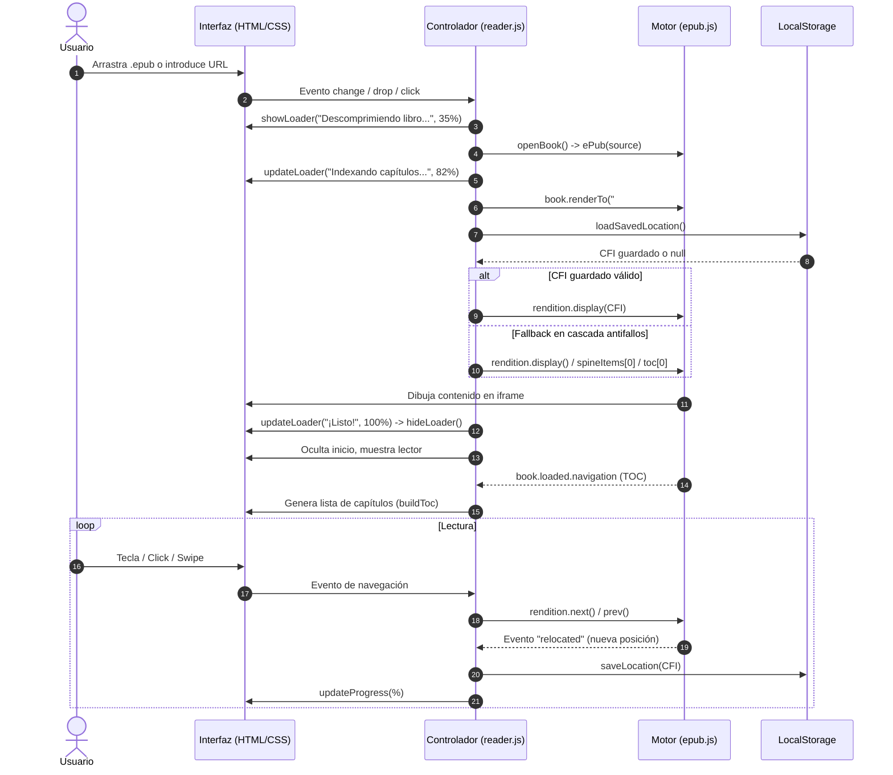

# 📖 Guía de Arquitectura y Funciones del Proyecto: Lector EPUB

Este documento detalla la estructura del proyecto, la responsabilidad de cada archivo y la descripción exhaustiva de todas las funciones, eventos y flujos de datos que componen el lector de libros electrónicos.

---

## 🗺️ Visión General de la Arquitectura

El proyecto es una **Single Page Application (SPA) 100% estática** que corre íntegramente en el navegador, sin necesidad de backend o servidor Node.js. 
Aprovecha las bibliotecas **epub.js** (renderizado y parser de formato EPUB) y **JSZip** (descompresión interna del archivo contenedor `.epub`).

```
epub-reader/
├── index.html       # Estructura del DOM (pantallas, barras, modales y paneles)
├── style.css        # Sistema de diseño, temas (Claro, Sepia, Oscuro) y animaciones
├── reader.js        # Lógica de la aplicación, control de estado y eventos
├── README.md        # Documentación de despliegue y uso para GitHub Pages
└── guide.md         # Esta guía técnica detallada de funciones y arquitectura
```

---

## 1. `index.html` (Estructura y Vistas)

Define las dos pantallas principales de la aplicación y la inclusión de dependencias externas.

### Dependencias externas (CDN):
* **`jszip.min.js` (v3.10.1):** Permite descomprimir los archivos `.epub` en memoria (un `.epub` es un contenedor `.zip` con XHTML, CSS e imágenes).
* **`epub.min.js` (v0.3.93):** Motor que interpreta el estándar IDPF/EPUB, gestiona las páginas (rendition), las secciones (spines), la navegación y el cálculo de porcentajes/CFIs.

### Secciones del DOM:

1. **Pantalla de Inicio (`#start-screen`):**
   * `#drop-zone`: Zona interactiva para soltar archivos arrastrados desde el explorador del sistema operativo.
   * `#file-input`: Input nativo oculto (`<input type="file" accept=".epub">`) que se activa al hacer clic en el botón "Elegir archivo".
   * `#url-input` y `#load-url-btn`: Campo de texto y botón para cargar libros mediante un enlace web público o ruta relativa (`./libros/libro.epub`).
   * Elementos informativos y consejos de uso en GitHub Pages.

2. **Pantalla del Lector (`#reader-screen`):**
   * **Barra de herramientas superior (`#toolbar`):**
     * `#btn-back`: Botón para cerrar el libro actual y regresar a la pantalla de inicio.
     * `.book-info`: Contenedores `#book-title` y `#book-author` para mostrar los metadatos del libro.
     * `#btn-toc`: Abre el panel lateral con la tabla de contenidos (índice).
     * `#btn-settings`: Abre el panel lateral de ajustes.
   * **Área de lectura principal (`#viewer-container`):**
     * `#viewer`: Contenedor `div` en el cual `epub.js` monta el iframe del libro.
     * `#prev` y `#next`: Botones flotantes laterales para pasar página.
   * **Barra de progreso inferior (`#progress-bar`):**
     * `#progress-fill`: Barra visual de relleno porcentual.
     * `#progress-text`: Indicador numérico (ej. `42%`).
   * **Panel lateral de índice (`#toc-panel`):**
     * `#close-toc`: Botón de cierre.
     * `#toc-list`: Contenedor donde se generan dinámicamente los enlaces a cada capítulo.
   * **Panel lateral de ajustes (`#settings-panel`):**
     * Selector de temas (`data-theme`: `light`, `sepia`, `dark`).
     * Selector de modo de lectura (`data-reading-mode`: `fast` con `Fast Sans` [por defecto] o `normal` con `Sans`).
     * Selector de BeeLine Reader (interruptor toggle on/off y selector de 3 degradados modernos: *Atardecer*, *Océano*, *Aurora*).
     * Control de tamaño de fuente (`#font-decrease`, `#font-size-value`, `#font-increase`).
     * Selector de modo de visualización (`data-flow`: `paginated` o `scrolled`).
   * **Capa de bloqueo (`#overlay`):**
     * Fondo oscurecido para cerrar paneles al hacer clic fuera de ellos.
   * **Overlay de Carga y Descompresión (`#loader-overlay`):**
     * Pantalla flotante con efecto cristal (`backdrop-filter: blur(10px)`) que informa visualmente del progreso porcentual al descomprimir y procesar libros.
     * `#loader-percent`: Indicador numérico tabular en tiempo real (0% al 100%).
     * `#loader-progress-fill`: Barra horizontal animada de progreso.
     * `#loader-status`: Texto explicativo de la fase actual (*Leyendo archivo*, *Descomprimiendo libro*, *Indexando capítulos*, etc.).
     * `#loader-error-container`: Panel de error con mensaje amigable y botón `#loader-error-btn` ("Volver al inicio") en caso de archivo no válido.
   * **Script de compatibilidad bfcache y Permissions Policy (`<head>`):**
     * Parche temprano que intercepta `EventTarget.prototype.addEventListener("unload")` y lo redirige a `pagehide`, evitando advertencias del navegador y permitiendo la aceleración del Back/Forward Cache.

---

## 2. `reader.js` (Lógica y Controladores)

Todo el código está encapsulado en una función autoejecutable (IIFE `(() => { ... })()`) para evitar colisiones en el ámbito global.

### Variables de Estado

| Variable | Tipo | Descripción |
|---|---|---|
| `book` | `ePub.Book` | Instancia principal del libro gestionada por `epub.js`. |
| `rendition` | `ePub.Rendition` | Objeto que gestiona el renderizado visual, estilos inyectados y eventos del iframe del libro. |
| `currentTheme` | `string` | Tema activo (`"light"`, `"sepia"`, `"dark"`). Persistido en `localStorage` (`"epub-theme"`). |
| `fontSize` | `number` | Porcentaje de tamaño de fuente (70% - 180%). Persistido en `localStorage` (`"epub-font-size"`). |
| `currentFlow` | `string` | Modo de lectura (`"paginated"` por páginas o `"scrolled"` por desplazamiento continuo). |
| `currentReadingMode` | `string` | Modo de tipografía (`"fast"` con Fast Sans por defecto, `"normal"` con Sans). Persistido en `localStorage` (`"epub-reading-mode"`). |
| `beelineEnabled` | `boolean` | Indica si la lectura guiada BeeLine Reader está activada. Persistido en `localStorage` (`"epub-beeline-enabled"`). |
| `beelineGradient` | `string` | Estilo de degradado activo (`"sunset"`, `"ocean"`, `"aurora"`). Persistido en `localStorage` (`"epub-beeline-gradient"`). |
| `bookKey` | `string` | Identificador alfanumérico derivado del nombre del archivo para almacenar y recuperar la posición de lectura. |

---

### Funciones Principales

#### `injectFontStyles(contents)`
* **Objetivo:** Inyecta en el `<head>` del iframe del EPUB la regla `@font-face` con URL absoluta hacia `fonts/Fast_Sans.ttf` y el selector con `!important` para sobrescribir las fuentes internas que pudiera tener el libro.
* **Operaciones:**
  1. Resuelve la URL absoluta del archivo `.ttf` mediante `new URL('fonts/Fast_Sans.ttf', window.location.href).href`.
  2. Crea y adjunta el elemento `<style id="epub-font-face">`.
  3. Crea y actualiza `<style id="epub-font-override">` con la familia tipográfica activa.

#### `applyReadingMode(mode)`
* **Objetivo:** Alterna entre la tipografía optimizada para lectura rápida (`Fast Sans`) y la tipografía estándar del sistema (`Sans`).
* **Operaciones:**
  1. Actualiza `currentReadingMode` y lo persiste en `localStorage`.
  2. Actualiza la clase activa en los botones `.reading-mode-btn`.
  3. Reinyecta los estilos de fuente en todos los `contents` activos del libro y llama a `rendition.themes.font()`.
  4. Si BeeLine está activo, recalcula las líneas para ajustarse a los nuevos anchos de palabra.

#### `applyBeeLine()` / `clearBeeLine()`
* **Objetivo:** Motor de lectura guiada por color estilo BeeLine Reader.
* **Operaciones:**
  * `applyBeeLine()`:
    1. Recorre párrafos (`p`, `blockquote`, `li`) en los `contents` del libro.
    2. Guarda el HTML original en `dataset.blOriginal` para permitir reversión limpia.
    3. Envuelve las palabras de los nodos de texto en `<span class="bl-w">` preservando el formato inline (`<em>`, `<strong>`, `<a>`).
    4. Detecta las líneas físicas analizando el orden de lectura y la posición `getBoundingClientRect()`, adaptándose tanto a columnas múltiples paginadas como a scroll continuo.
    5. Asigna una gradación cromática continua de tal modo que la última palabra de la línea $N$ coincide exactamente con el color inicial de la línea $N+1$.
    6. Aplica las paletas calibradas para Light, Sepia y Dark.
  * `clearBeeLine()`:
    Restaura el contenido original guardado en `dataset.blOriginal` y elimina marcas temporales sin recargar el iframe.

#### `setBeelineEnabled(enabled)` / `setBeelineGradient(gradient)`
* **Objetivo:** Controla el interruptor on/off de BeeLine y el cambio de paleta cromática (*Atardecer*, *Océano*, *Aurora*).

#### `applyTheme(theme)`
* **Objetivo:** Aplica un tema visual al interfaz general y al contenido dentro del libro.
* **Operaciones:**
  1. Modifica el atributo `data-theme` en `document.documentElement` para cambiar las variables CSS de la interfaz.
  2. Guarda la elección en `localStorage`.
  3. Actualiza el estado visual de los botones de selección (`.theme-btn.active`).
  4. Si hay un `rendition` activo, inyecta mediante `rendition.themes.default()` los colores de fondo y texto correspondientes dentro del iframe del libro, asegurando uniformidad visual.
  5. Si BeeLine está activo, re-aplica el degradado con los tonos adaptados al nuevo tema.

#### `setFontSize(size)`
* **Objetivo:** Modifica el tamaño de la tipografía dentro del libro.
* **Operaciones:**
  1. Limita el valor entre un mínimo de 70% y un máximo de 180% (`Math.max(70, Math.min(180, size))`).
  2. Actualiza el texto en pantalla (`#font-size-value`).
  3. Guarda el valor en `localStorage`.
  4. Si hay un `rendition` activo, llama a `rendition.themes.fontSize("${fontSize}%")`.
  5. Si BeeLine está activo, recalcula las líneas adaptándose al nuevo flujo de texto.

#### `setFlow(flow)`
* **Objetivo:** Configura el modo de paginación o scroll continuo.
* **Operaciones:**
  1. Actualiza `currentFlow` y `localStorage`.
  2. Modifica la clase activa en los botones de modo de visualización.

#### `openPanel(panel)` / `closePanels()`
* **Objetivo:** Controla la visibilidad de los paneles laterales (Índice y Ajustes).
* **Operaciones:**
  * `openPanel(panel)`: Añade la clase `.open` al panel indicado y elimina `.hidden` de `#overlay`.
  * `closePanels()`: Remueve `.open` de `#toc-panel` y `#settings-panel`, y oculta `#overlay`.

#### `updateProgress(percentage)`
* **Objetivo:** Actualiza la barra y porcentaje inferior de lectura.
* **Operaciones:**
  1. Convierte el valor decimal (0 a 1) en entero porcentual (0% a 100%).
  2. Ajusta el ancho de `#progress-fill` (`style.width = pct%`).
  3. Actualiza el texto `#progress-text`.

#### `saveLocation(cfi)` / `loadSavedLocation()`
* **Objetivo:** Persistencia del punto exacto de lectura.
* **Operaciones:**
  * `saveLocation(cfi)`: Almacena en `localStorage` bajo la clave `epub-loc-${bookKey}` el identificador CFI (*Canonical Fragment Identifier*) de EPUB.
  * `loadSavedLocation()`: Recupera dicho CFI si el usuario vuelve a abrir el mismo libro más adelante.

#### `buildToc(toc, level = 1)`
* **Objetivo:** Construcción recursiva del árbol de la tabla de contenidos (capítulos y subcapítulos).
* **Operaciones:**
  1. Itera sobre cada elemento del array `toc` provisto por `epub.js`.
  2. Crea un enlace `<a>` con la clase CSS correspondiente a su nivel de profundidad (`toc-level-1`, `toc-level-2`, etc.).
  3. Asocia un listener `click` que salta directamente a la sección mediante `rendition.display(item.href)` y cierra los paneles.
  4. Si el capítulo tiene sub-secciones (`item.subitems`), realiza una llamada recursiva incrementando el nivel.

#### `showLoader(status, initialPct)` / `updateLoader(pct, status)` / `hideLoader()` / `showLoaderError(msg)`
* **Objetivo:** Gestión integral de la interfaz del loader durante la descompresión, indexación y renderizado.
* **Operaciones:**
  * `showLoader(status, initialPct)`: Revela `#loader-overlay`, resetea el indicador numérico y barra al porcentaje inicial indicado y muestra el mensaje de estado.
  * `updateLoader(pct, status)`: Aplica una transición suave a `#loader-progress-fill`, actualiza el porcentaje tabular `#loader-percent` y refresca `#loader-status`.
  * `hideLoader()`: Lleva el progreso al 100% (*"¡Listo!"*) y desvanece el overlay tras 280ms.
  * `showLoaderError(msg)`: Oculta el spinner y barra, presentando una advertencia clara con el botón `#loader-error-btn` ("Volver al inicio") sin dejar la interfaz bloqueada.

#### `openBook(source, name = "libro")`
* **Objetivo:** Función central que procesa, descomprime y renderiza el libro EPUB desde un ArrayBuffer o URL con seguimiento porcentual y tolerancia a fallos.
* **Operaciones:**
  1. **Inicio del Loader (35%):** Muestra `#loader-overlay` informando del inicio de la descompresión.
  2. **Limpieza:** Destruye cualquier instancia previa (`book.destroy()`) y limpia los contenedores `#viewer` y `#toc-list`.
  3. **Inicialización y Descompresión (55%):** Invoca `book = ePub(source)` y define `bookKey` sanitizado.
  4. **Metadatos e Indexación (70% - 85%):** Procesa `book.loaded.metadata` y `book.loaded.spine` para preparar títulos y árbol de capítulos.
  5. **Configuración de Rendition (90%):** Crea la instancia `book.renderTo(viewer, options)` y registra los hooks de tipografía y prevención de `unload`.
  6. **Estrategia de Renderizado en Cascada (Fallback Antifallos):**
     Para evitar pantallas en blanco o que el usuario tenga que ir manualmente al TOC si una posición guardada está corrupta o no coincide con la edición del libro, ejecuta cuatro intentos sucesivos:
     * *Intento 1:* Carga la posición guardada (`loadSavedLocation()`). Si lanza error, elimina el CFI dañado de `localStorage` y continúa automáticamente.
     * *Intento 2:* Ejecuta `rendition.display()` estándar (inicio natural del documento).
     * *Intento 3:* Si el anterior falla, obtiene el primer elemento del spine (`book.spine.spineItems[0].href`) y lo renderiza directamente.
     * *Intento 4:* Si persiste el fallo, consulta `book.loaded.navigation` y proyecta el primer enlace del índice (`nav.toc[0].href`).
  7. **Finalización (100%):** Oculta `#start-screen`, revela `#reader-screen`, aplica temas, fuentes y BeeLine, y oculta el loader.

#### `loadBookFromUrl(url, name)`
* **Objetivo:** Descarga libros desde enlaces web o rutas relativas utilizando la API `ReadableStream` para reportar el porcentaje real de descarga en tiempo real antes de pasar el ArrayBuffer a `openBook`.

#### `keyListener(e)`
* **Objetivo:** Permite pasar de página mediante el teclado.
* **Teclas:**
  * Flecha izquierda (`ArrowLeft`) o Retroceder página (`PageUp`): Página anterior (`rendition.prev()`).
  * Flecha derecha (`ArrowRight`), Avanzar página (`PageDown`) o Barra espaciadora (` `): Página siguiente (`rendition.next()`).

---

### Controladores de Eventos del Usuario

* **Selección de archivo local (`fileInput`):** Lee el archivo mediante `FileReader` con evento `onprogress` reportando del 0% al 30% en el loader, y envía el buffer a `openBook`.
* **Arrastrar y soltar (`dropZone`):**
  * `dragover` / `dragleave`: Añade o quita la clase visual `.dragover`.
  * `drop`: Valida extensión `.epub`, reporta progreso de lectura y ejecuta `openBook`.
* **Carga por URL (`loadUrlBtn` y tecla `Enter` en `urlInput`):** Invoca `loadBookFromUrl` con seguimiento de descarga.
* **Botones de navegación (`#prev`, `#next`):** Invocan `rendition.prev()` y `rendition.next()`.
* **Botón volver (`#btn-back` y `#loader-error-btn`):** Destruye la instancia del libro, oculta overlays y regresa a `#start-screen`.
* **Gestos táctiles / Swipe:**
  * Registra la coordenada X al iniciar el toque (`touchstart`).
  * Calcula la distancia horizontal recorrida al soltar (`touchend`). Si el desplazamiento supera los 60px, avanza o retrocede de página.
* **Parámetros en la URL (Carga automática):**
  * Al iniciar, analiza los parámetros `?book=`, `?epub=` o `?url=`. Si encuentra alguno, descarga y abre el libro automáticamente mediante `loadBookFromUrl`.

---

## 3. `style.css` (Diseño y Estilos)

### Sistema de Tokens CSS (Variables)
El archivo define variables para tres esquemas de color:
1. **Tema Claro (`:root`):** Fondo cálido tipo papel (`#f8f6f1`), texto carbón (`#1a1a1a`), acento azul (`#2563eb`).
2. **Tema Oscuro (`[data-theme="dark"]`):** Fondo OLED/negro suave (`#121212`), texto claro (`#e8e8e8`), acento celeste (`#60a5fa`).
3. **Tema Sepia (`[data-theme="sepia"]`):** Fondo apergaminado (`#f4ecd8`), texto marrón editorial (`#5b4636`), acento madera (`#8b5e3c`).

### Componentes Clave:
* **Regla `@font-face` Fast Sans:** Declara la familia tipográfica `Fast Sans` apuntando a `fonts/Fast_Sans.ttf` para su uso en la interfaz y dentro del iframe.
* **Selector de Modo de Lectura (`.reading-mode-buttons`, `.reading-mode-btn`):** Botones segmentados con micro-animación para elegir entre Lectura Rápida (Fast Sans) y Lectura Normal (Sans).
* **Interruptor Deslizante (`.toggle-switch`, `.toggle-slider`):** Switch animado tipo iOS para activar o desactivar BeeLine Reader de manera instantánea.
* **Cuadrícula de Degradados BeeLine (`.gradient-grid`, `.gradient-btn`):** Tarjetas interactivas con previsualización en miniatura (`.gradient-preview`) de las paletas *Atardecer*, *Océano* y *Aurora*, con degradados CSS adaptativos para modo claro y oscuro.
* **Modal Loader y Barra de Descompresión (`.loader-overlay`, `.loader-card`):** Capa flotante con efecto *glassmorphism* (`backdrop-filter: blur(10px)`), anillo giratorio suave (`.loader-ring`), icono pulsante, porcentaje numérico tabular de alto contraste (`.loader-percent`) y barra de progreso con gradiente continuo (`.loader-progress-fill`).
* **Tarjeta de inicio (`.start-card`):** Centrada horizontal y verticalmente, sombras suaves (`--shadow`) y bordes redondeados (`border-radius: 20px`).
* **Zona de Drop (`.drop-zone`):** Borde punteado que reacciona con transición y color de acento cuando se arrastra un archivo encima (`.dragover`).
* **Barra superior (`#toolbar`):** Fija a 52px de altura con flexbox, mostrando metadatos truncados (`text-overflow: ellipsis`) para evitar desbordamientos en pantallas pequeñas.
* **Contenedor del visor (`#viewer-container`):** Ocupa el 100% del espacio restante entre el toolbar y la barra de progreso. Aloja los botones flotantes de navegación con opacidad progresiva en hover.
* **Paneles deslizantes (`.panel`):** Posicionados de forma fija a la derecha con ancho máximo de 360px. Usan transiciones aceleradas por hardware (`transform: translateX(100%)` a `translateX(0)`).
* **Barra de progreso (`#progress-bar`):** Situada en la parte inferior con altura fija de 28px, contiene una barra animada (`#progress-fill`) y porcentaje centrado.
* **Media Queries (`@media (max-width: 600px)`):** Adapta botones, oculta texto secundario y ajusta anchos para una experiencia óptima en dispositivos móviles.

---

## 4. `README.md` (Documentación del Repositorio)

Proporciona la introducción general al proyecto, instrucciones de despliegue en GitHub Pages, recomendaciones para organizar libros en el repositorio (`/libros/mi-libro.epub`), guía de controles y comandos para ejecución en servidor local (`python -m http.server` o `npx serve`).

---

## 🔄 Flujo de Datos y Ciclo de Vida de una Lectura


